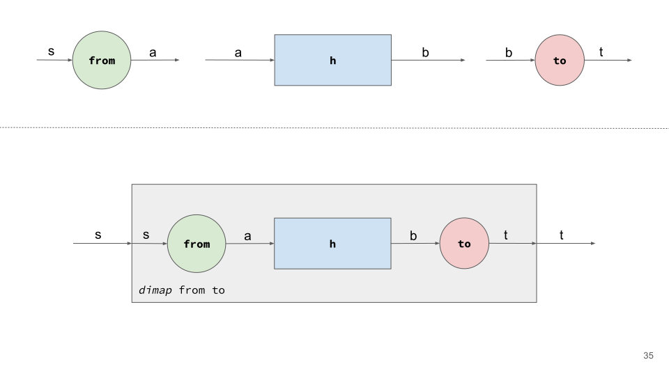
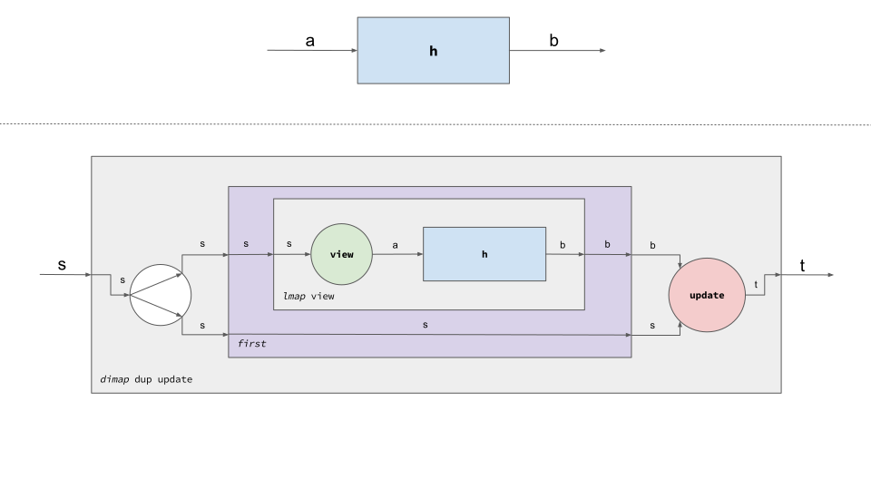
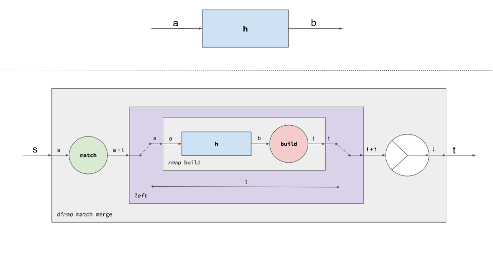
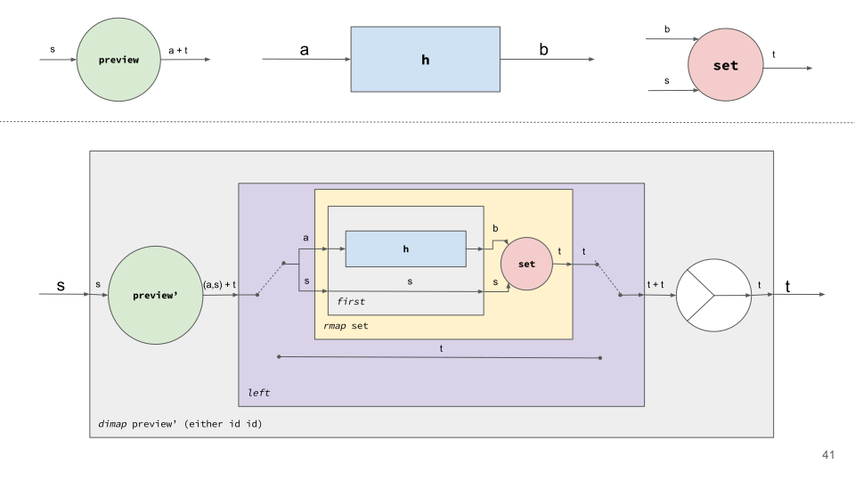
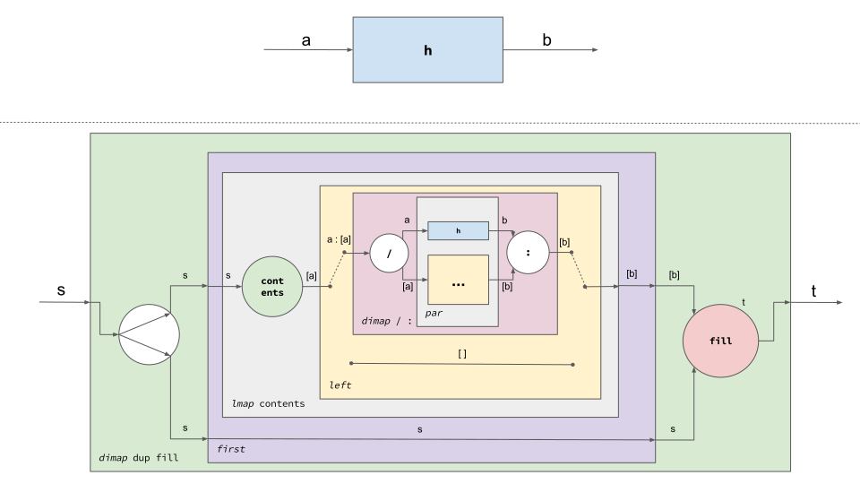
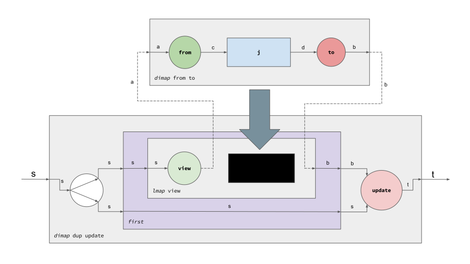

# Don't Fear the Profunctor Optics (Part 3/3)

PREVIOUSLY: [Profunctors as Generalized Functions](Profunctors.md)

## Profunctor Optics

Profunctor, as concrete, is just another representation for optics. The general
structure for profunctor optics is the next one:

```haskell
type Optic p s t a b = p a b -> p s t
```

So, every optic defined using this representation must know how to turn a `p a
b` into a `p s t`. What does this mean? Previously, we said that we can see this
profunctors as generalizations of functions, and we represented them as boxes.
Besides, we could appreciate that optics in general, are abstractions that deal
with polymorphic focus and whole values. Having said so, the alias we have just
shown tells us that in order to fulfill an optic, we must determine how to take
a generalized function on the focus to its counterpart on the whole.

For each optic kind, we'll show how to expand a focus box into a whole box,
using our diagram notation. That will determine the minimal constraints that are
needed to conform the particular optic. Then, we'll follow the opposite
direction, bringing the concrete representation from the profunctor one.
Finally, the examples which were shown in the first installment of this post
series will be redefined with the new representation.

### Profunctor Adapter

We'll start by `Adapter`, given its simple nature. Recall that we'll be facing
the same problem for every optic kind: we need to turn a `p a b` into a `p s t`.
Undoubtedly, the extension process will be different for each case.
Particularly, we saw that adapters are represented concretely by means of `from ::
s -> a` and `to :: b -> t`. How could we get a `p s t` given `p a b` and this
pair of functions? We show it in the next picture:



Thereby, the only feature that we require to extend `h :: p a b` into `p s t` is
`Profunctor`'s `dimap`. That's why profunctor adapters are represented as
follows:

```haskell
type AdapterP s t a b = forall p . Profunctor p => Optic p s t a b
```

In fact, we could translate the diagram above into Haskell this way:

```haskell
adapterC2P :: Adapter s t a b -> AdapterP s t a b
adapterC2P (Adapter f t) = dimap f t
```

How do we recover the concrete representation? To do so, we need to use a
specific profunctor instance for each operator. For instance, we require `UpStar
Constant` and `Tagged` to recover `from` and `to`, respectively:

```haskell
from' :: AdapterP s t a b -> s -> a
from' ad = getConstant . runUpStar (ad (UpStar Constant))

to' :: AdapterP s t a b -> b -> t
to' ad = unTagged . ad . Tagged
```

These definitions, though simple, are not straightforward at all. By now, we're
more than happy if you feel comfortable with the diagrams.

Finally, we'll redefine our `shift` example using the new profunctor
representation for adapters:

```haskell
shift' :: AdapterP ((a, b), c) ((a', b'), c') (a, (b, c)) (a', (b', c'))
shift' = dimap assoc assoc' where
  assoc  ((x, y), z) = (x, (y, z))
  assoc' (x, (y, z)) = ((x, y), z)
```

### Profunctor Lens

Next, we'll try to define lenses. Its concrete optic is a little bit more
complex, containing `view :: s -> a` and `update :: (b, s) -> t`. It seems
trivial to extend `p a b` in the left with `view`, to get a `p s b`. However, we
can't use `update` in the right, since it requires not only a `b` but also a
`s`. If we review our toolbox, we know that it's possible to have the original
`s` passing through, living along with the original box. This is how we build a
lens diagram from `p a b`:



There's a new component which simply replicates the input, to make it
interoperable with a multi-input box. Since we only require `Profunctor` and
`Cartesian`, our profunctor lens is represented as follows:

```haskell
type LensP s t a b = forall p . Cartesian p => Optic p s t a b
```

And this is how we encode the previous diagram:

```haskell
lensC2P :: Lens s t a b -> LensP s t a b
lensC2P (Lens v u) = dimap dup u . first . lmap v where
  dup a = (a, a)
```

We could recover the concrete lens from a profunctor lens by using `UpStar
Constant` and `->` instances:

```haskell
view' :: LensP s t a b -> s -> a
view' ln = getConstant . runUpStar (ln (UpStar Constant))

update' :: LensP s t a b -> (b, s) -> t
update' ln (b, s) = ln (const b) s
```

Now it's turn to redefine `π1`. You might be surprised with this one:

```haskell
π1' :: LensP (a, c) (b, c) a b
π1' = first
```

Indeed, `first` provides all we need to access the first component of a tuple!
Consequently, `second` could serve us to access the corresponding second
component.

### Profunctor Prism

Now, it's the turn for profunctor prisms. Recall that the concrete definition
contains `match :: s -> a + t` and `build :: b -> t`. Again, if we want to
extend our `p a b` into a `p s t` we're gonna need additional help. The
resulting picture for a prism circuit is represented in the next picture:



There, `p a b` is extended with `build` on the right. Then, it's required to
include a lower exclusive path for non-existing focus. Choosing between one path
or another will be determined by the switch input, which is in turn determined
by `match`. Finally, a tiny adaptation on the right is applied, to turn a `t +
t` into a `t`. From this diagram, we can infer that a prism depends on
`Cocartesian`:

```haskell
type PrismP s t a b = forall p . Cocartesian p => Optic p s t a b
```

As usual, here it is the textual version of the diagram above:

```haskell
prismC2P :: Prism s t a b -> PrismP s t a b
prismC2P (Prism m b) = dimap m (either id id) . left . rmap b
```

The instances that should be fed to a profunctor prism in order to recover a
concrete prism are `UpStar (Either a)` and `Tagged`:

```haskell
match' :: PrismP s t a b -> s -> Either a t
match' pr = runUpStar (pr (UpStar Left))

build' :: PrismP s t a b -> b -> t
build' pr = unTagged . pr . Tagged
```

Lastly, we redefine `the` with our brand new prism:

```haskell
the' :: PrismP (Maybe a) (Maybe b) a b
the' = dimap (maybe (Right Nothing) Left) (either Just id) . left
```

### Profunctor Affine

Previously, we saw that `preview :: s -> a + t` and `set :: (b, s) -> t` are the
primitives that conform concrete prisms. This time, turning `h :: p a b` into `p
s t` will require several features. This is what we need to achieve it:



Thereby, we apply the original generalized function only if the focus exists. In
that case, we still need the original whole value to be able to apply `set`.
Finally, if our focus wasn't there, we can select the lower path directly. Since
we used cartesian and cocartesian features, this leads to this alias for affine:

```haskell
type AffineP s t a b = forall p . (Cartesian p, Cocartesian p) => Optic p s t a b
```

Our diagram is translated into Haskell this way:

```haskell
affineC2P :: Affine s t a b -> AffineP s t a b
affineC2P (Affine p st) = dimap preview' merge . left . rmap st . first where
  preview' s = either (\a -> Left (a, s)) Right (p s)
  merge = either id id
```

As usual, we can go back to concrete affine as well:

```haskell
preview' :: AffineP s t a b -> s -> Either a t
preview' af = runUpStar (af (UpStar Left))

set' :: AffineP s t a b -> (b, s) -> t
set' af (b, s) = af (const b) s
```

Finally, we're going to adapt `maybeFirst` to this new setting:

```haskell
maybeFirst' :: AffineP (Maybe a, c) (Maybe b, c) a b
maybeFirst' = first . dimap (maybe (Right Nothing) Left) (either Just id) . left
```

This expression is quite familiar to us, isn't it? In fact, it combines somehow
the implementations of `π1'` and `the'`. In fact, this compiles nicely:

```haskell
maybeFirst'' :: AffineP (Maybe a, c) (Maybe b, c) a b
maybeFirst'' = π1' . the'
```

We're composing different optic kinds with `.`! What has just happened?!?! We'll
come back to composition later, but you know what? You have been doing it for
all this time.

### Profunctor Traversal

Recall that we defined our fake traversal in terms of `contents :: s -> [a]` and
`fill :: ([b], s) -> t`. We should be able to pass every focus value through our
original `h :: p a b` and collect the results. Here it's the corresponding
diagram:



This definition is quite complex, huh? It even requires recursion! (Notice that
the inner yellow box corresponds with the outer yellow one) Broadly, we are
extracting the list of focus values and passing them through our original
generalized function. However, since this list could be empty, we need to
consider an alternative path, which is used as the recursion base case. We need
monoidal to make both recursive box and original `h` coexist. Since traversals
require contextual information when updating, cartesian is also necessary. As
new elements, there is `/` which turns a `Cons` into a head-tail tuple and `:`
which does exactly the inverse operation. The rest of the diagram should be
straightforward. We represent profunctor traversals as follows:

```haskell
type TraversalP s t a b = forall p . (Cartesian p, Cocartesian p, Monoidal p) => Optic p s t a b
```

Here's the code associated to the diagram:

```haskell
traversalC2P :: Traversal s t a b -> TraversalP s t a b
traversalC2P (Traversal c f) = dimap dup f . first . lmap c . ylw where
  ylw h = dimap (maybe (Right []) Left . uncons) merge $ left $ rmap cons $ par h (ylw h)
  cons = uncurry (:)
  dup a = (a, a)
  merge = either id id
```

We'll show now how to recover `contents`, since `fill` is kind of broken:

```haskell
contents' :: TraversalP s t a b -> s -> [a]
contents' tr = getConstant . runUpStar (tr (UpStar (\a -> Constant [a])))
```

Finally, our concrete `firstNSecond` traversal is adapted as follows:

```haskell
firstNSecond' :: TraversalP (a, a, c) (b, b, c) a b
firstNSecond' pab = dimap group group' (first (pab `par` pab)) where
  group  (x, y, z) = ((x, y), z)
  group' ((x, y), z) = (x, y, z)
```

## Optic Composition is Function Composition

Undoubtedly, it's easier to read a concrete optic definition than a profunctor
optic one. Concrete optics are just a bunch of simple functions that every
programmer is comfortable with, while profunctor optics require grasping
profunctors and contextualizing them in the problem of updating immutable data
structures. Why is this representation so trendy? The thing is that profunctor
optics take composability to the next level.

Profunctor optics are just functions, and functions enable the most natural way
of composition in functional programming. We can compose functions, and
therefore profunctor optics, by using `.`. Given this situation, there's no need
to implement a specific combinator for each pair of optics. In fact, `first .
first` or `second . left . the` are perfectly valid examples of optic
composition. Notice that we can even compose optics heterogeneously, as it's
evidenced in the last expression, where a lens, a prism and an affine are
composed together. But hold a second, which optic results of composing two
arbitrary optics? Haskell's elegance helps a lot to answer this question.

When Haskell composes two functions, it merges the constraints imposed for each
of them, and set them as constraints for the resulting function. Therefore, if
we compose a lens (that depends on cartesian) and a prism (that depends on
cocartesian) we end up with an optic that depends on both cartesian and
cocartesian. Is this output familiar to you? Of course, it's exactly the
definition of `AffineP`, which is the result of combining a lens with a prism.
According to this view, we can see that a traversal, which is the most
restrictive optic we've seen in this article, is able to represent the rest of
them, though won't be using its full potential when doing so. You can find
[here](http://julien-truffaut.github.io/Monocle/optics.html) a graph that
shows this hierarchy.

Now, let's play with composition:

```haskell
λ> let tr' = π1' . the' . firstNSecond'
λ> contents' tr' (Just ("profunctor", "optics", 'a'), 0)
["profunctor","optics"]
λ> tr' length (Just ("profunctor", "optics", 'a'), 0)
(Just (10,6,'a'),0)
```

First of all we compose different optics to generate a traversal. It focuses on
the `a`s  which are nested in a whole `(Maybe (a, a, c), d)`. Then, we can use
`contents'` to collect them or even feed another profunctor instance. For
example, if we use `(->)` we should get a `modify`. Therefore, passing `length`
as argument applies the very same function to each focus. This elegance is
simply awesome.

On the other hand, we can use our computation diagrams to show a different
perspective on profunctor optics composition. This is what happens when we
compose a lens with an adpater:



Our lens requires a `p a b` to produce a `p s t`. When we embed (or compose) the
adapter, we're being more specific about that gap. We still want to produce a `p
s t`, but we don't need a full `p a b` to do so. We can build it from a smaller
`p c d` computation instead. The resulting diagram uses only `Profunctor` and
`Cartesian` utilities to be built. Those are exactly the constraints required by
lens, so we can determine that composing a lens with an adapter results in
another lens, as expected.

## Discussion

In this series, we've introduced optics, profunctors and finally profunctor
optics. Particularly, we've been toying around with adapters, lenses, prisms,
affines and traversals, but you should take into account that there are [many
others](http://oleg.fi/gists/images/optics-hierarchy.svg) out there. The
contents have been heavily inspired by [this
paper](http://www.cs.ox.ac.uk/people/jeremy.gibbons/publications/poptics.pdf) by
Pickering et al. As a consequence, we've tried to remain in line with the
conventions adopted in it. In fact, our major contribution relies on providing
several diagrams to make profunctors and profunctor optics more approachable.
They are mainly based on [Hughes' arrows](https://www.haskell.org/arrows/) ones.

In general, we've priorized diagram simplicity over code conciseness (since we
pursued to emphasize the concrete operators above all). This is evidenced in the
Haskell encodings of the profunctor optic diagrams, where the original paper
provides nicer implementations. Following with our particular implementation,
you might have noticed that some functions that recover concrete operations from
profunctor optics are exactly the same, for instance `update'` and `set'`. In
fact, profunctor optic libraries such as *mezzolens* don't supply particular
interfaces for every optic. Instead, they provide [operations for particular
profunctors](https://hackage.haskell.org/package/mezzolens-0.0.0/docs/Mezzolens.html)
that could be used by arbitrary optics (as long as their constraints allow it).

Instancing profunctor optics from scratch is not straightforward at all. In
addition, different instances turn out to follow similar patterns. Therefore we
suggest to create the concrete optic manually and then translate it to its
profunctor version. In our experience, profunctor optics generated this way
might not be the most direct ones, but they are good enough for most of cases.

We've only covered two optic representations. However, you should know that
we're not moving from concrete to profunctor drastically. Indeed, there are
other intermediate representations that we've been avoiding on purpose. The most
widespread is [*Van
Laarhoven*](https://www.twanvl.nl/blog/haskell/cps-functional-references), which
is deployed in [Kmett's awesome optic library](https://github.com/ekmett/lens/).
For instance, lenses look as follows:

```haskell
type LensVL s t a b = Functor f => (a -> f b) -> (s -> f t)
```

You can immediately realize that there are many similarities to the profunctor
formulation. Try to implement an isomorphism between `LensVL` and `LensP` as an
exercise.

Finally, we must say that profunctor optics are trendy. Particularly, they're
becoming [quite relevant](https://www.youtube.com/watch?v=OJtGECfksds) in
PureScript. We don't know if they will become mainstream in functional
languages, but I hope you don't fear them anymore.
