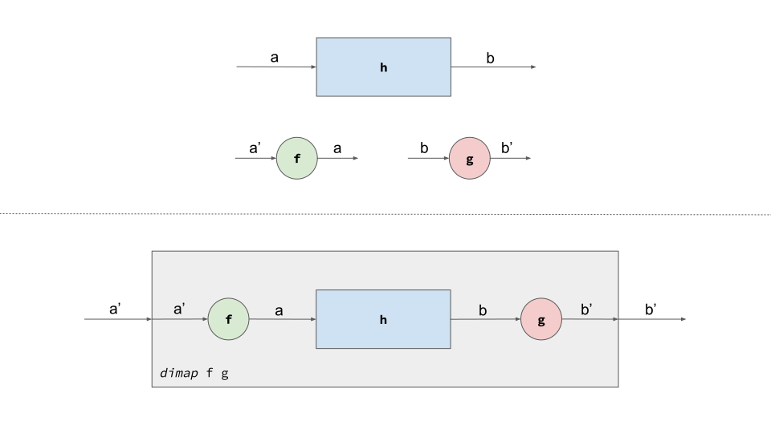
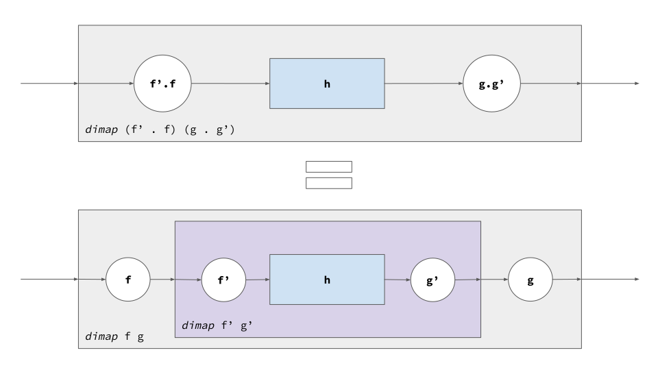
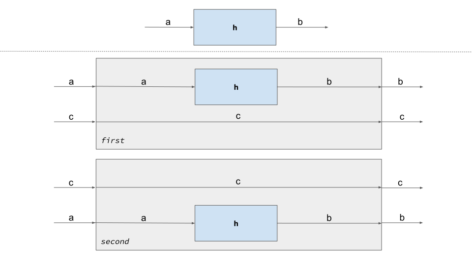
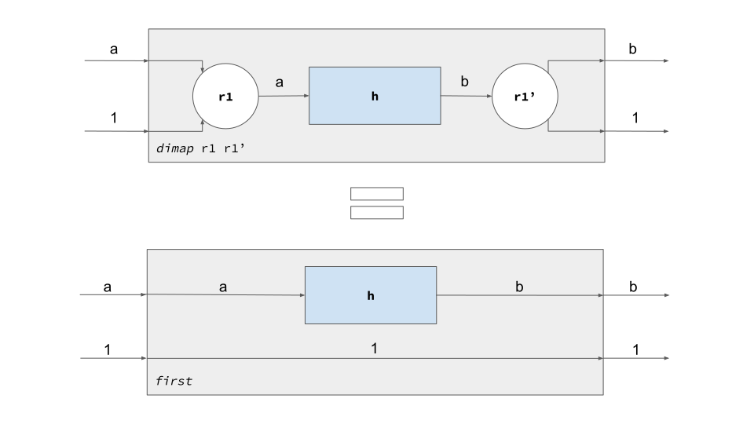
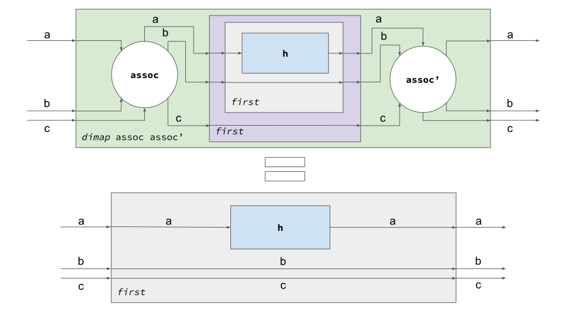
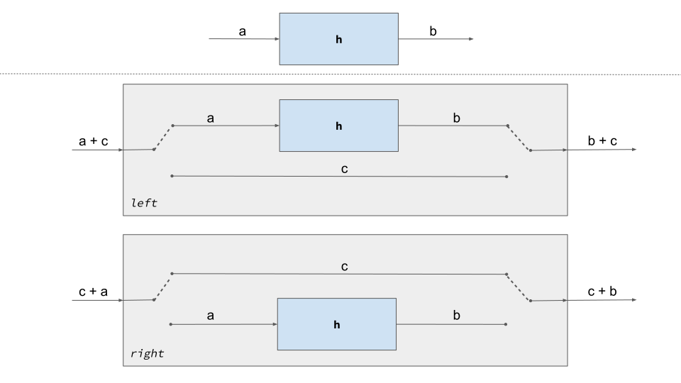
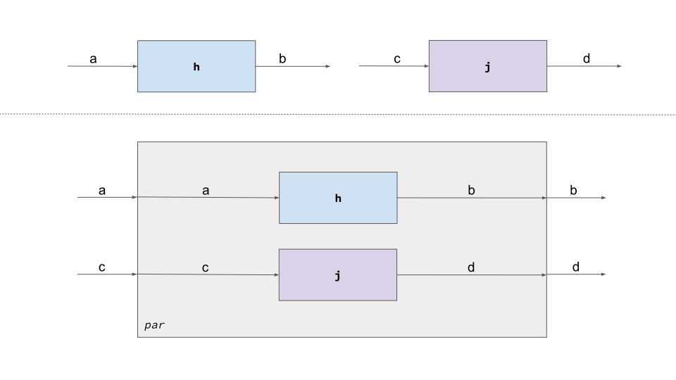

# Don't Fear the Profunctor Optics (Part 2/3)

PREVIOUSLY: [Optics, Concretely](Optics.md)

Today it's the turn of profunctors. We'll start with a very brief introduction
to covariant and contravariant functors. Then, we'll see the most relevant
members of the profunctor family. Particularly, we'll show their representation
as typeclasses (along with their associated laws and several instances) and a
visual representation where profunctors are seen as boxes that take inputs and
produce outputs. Here we go!

## Profunctors as Generalized Functions

(Covariant) Functors arise everywhere! When we put our programmer's glasses on,
we can view them [as
containers](https://bartoszmilewski.com/2014/01/14/functors-are-containers/)
that can be mapped over with `fmap`:

```haskell
class Functor f where
  fmap :: (a -> b) -> f a -> f b
```

Not surprisingly, functions are functors, when they're parameterized on their
result type:

```haskell
instance Functor ((->) r) where
  fmap f g = f . g
```

Contravariant functors are pretty much like functors, but they require a
reversed arrow to map the container in the expected direction:

```haskell
class Contravariant f where
  cmap :: (b -> a) -> f a -> f b
```

Functions are also contravariant, this time on their first type parameter:

```haskell
newtype CReader r a = CReader (a -> r)

instance Contravariant (CReader r) where
  cmap f (CReader g) = CReader (g . f)
```

Now, we should be ready to approach profunctors. For each member of the
profunctor family, we'll show its typeclass and associated laws, along with a `(->)`
instance. Then, we'll provide an informal explanation which is supported by our
profunctor diagrams.

### Profunctor

Profunctors are sort of functors which are contravariant on their first argument
and covariant on their second one. Thereby, its abstract method `dimap` takes
two functions as input:

```haskell
class Profunctor p where
  dimap :: (a' -> a) -> (b -> b') -> p a b -> p a' b'

  lmap :: (a' -> a) -> p a b -> p a' b
  lmap f = dimap f id
  rmap :: (b -> b') -> p a b -> p a b'
  rmap f = dimap id f
```

`lmap` and `rmap` are utilities to map either the covariant or the contravariant
type parameter. Therefore, they correspond with contravariant's `cmap` and
functor's `fmap`, respectively. As every interesting typeclass, profunctors do
obey some laws:

```haskell
dimap id id = id
dimap (f' . f) (g . g') = dimap f g · dimap f' g'
```

As expected, functions do fit perfectly as instances of this typeclass:

```haskell
instance Profunctor (->) where
  dimap f g h = g . h . f
```

#### Explanation

Profunctors are best understood as generalizations of functions. As a
consequence, we can see them as boxes that take an input and provide an output.
Thereby, `dimap` just adapts inputs and outputs to conform new boxes. Given this
intuition, I noticed that drawing diagrams could be helpful to understand the
profunctor family. Soon, I realized that these new diagrams were quite similar
to the ones provided by [Hughes for arrows](https://www.haskell.org/arrows/). In
fact, there are [strong
connections](https://stackoverflow.com/questions/38169453/whats-the-relationship-between-profunctors-and-arrows)
among them. From now on, we'll be using them to provide a visual perspective of
profunctors:



Here, `h :: p a b` is our original profunctor box. For being a profunctor we
know that it can be extended with `dimap`, using plain functions `f :: a' -> a`
and `g :: b -> b'`, represented as circles. Once we apply `dimap` a surrounding
profunctor box is generated, which is able to take `a'`s as input and produce
`b'`s as output.

These diagrams also help to better understand profunctor laws. This picture
represent the first of them `dimap id id = id`:


Basically, it says that we can replace an `id` function with a raw cable. Then,
the surrounding profunctor box would become redundant. On the other hand, the
second law `dimap (f' . f) (g . g') = dimap f g · dimap f' g'` is represented as
follows:



It tells us that we can split a `dimap` which takes composed functions into a
composition of `dimap`s where each takes the corresponding uncomposed functions.

### Cartesian

Following down the profunctor family, we find `Cartesian`:

```haskell
class Profunctor p => Cartesian p where
  first  :: p a b -> p (a, c) (b, c)
  second :: p a b -> p (c, a) (c, b)
```

These are the laws associated to this typeclass (skipping the counterparts for
`second`):

```haskell
dimap runit runit' h = first h
dimap assoc assoc' (first (first h)) = first h
-- where
runit  :: (a, ()) -> a
runit' :: a -> (a, ())
assoc  :: (a, (b, c)) -> ((a, b), c)
assoc' :: ((a, b), c) -> (a, (b, c))
```

The function instance for cartesian is straightforward:

```haskell
instance Cartesian (->) where
  first  f (a, c) = (f a,   c)
  second f (c, a) = (  c, f a)
```

#### Explanation

Again, this typeclass contains methods that turn certain box `p a b` into
new ones. Particularly, these methods make our original box coexist with
an additional input `c`, either in the first or second position. Using our
diagram representation, we get:



As usual, we start from a simple `h :: p a b`. Once `first` is applied we can
see how `c` input passes through, while `a` is turned into a `b`, using the
original box `h` for the task. The most characteristic feature of the resulting
box is that it takes two inputs and produce two outputs.

When we draw the first cartesian law `dimap runit runit' h = first h`, we get
the next diagram:



This law is claiming that `first` should pass first input through `h` while
second input should be preserved in the output as is. That intuition turns out
to be implicit in our diagram representation. The second law `dimap assoc assoc'
(first (first h)) = first h` is shown graphically in this image:



This representation seems more complex, but in essence, it states that nesting
`first`s doesn't break previous law. This is implicit in the diagram as well,
where `b` and `c` simply pass trough, regardless of the nested boxes in the
upper case.

### Cocartesian

Next, there is `Cocartesian`, whose primitives are shown in the following
typeclass:

```haskell
class Profunctor p => Cocartesian p where
  left  :: p a b -> p (Either a c) (Either b c)
  right :: p a b -> p (Either c a) (Either c b)
```

Its laws are these ones (ignoring `right` counterparts):

```haskell
dimap rzero rzero' h = left h
dimap coassoc' coassoc (left (left h)) = left h
--where
rzero    :: Either a Void -> a
rzero'   :: a -> Either a Void
coassoc  :: Either a (Either b c) -> Either (Either a b) c
coassoc' :: Either (Either a b) c -> Either a (Either b c)
```

And here it's the function instance:

```haskell
instance Cocartesian (->) where
  left  f = either (Left . f) Right
  right f = either Left (Right . f)
```

#### Explanation

Indeed, this typeclass is very similar to `Cartesian`, but the resulting box
deals with sum types (`Either`) instead of product types. What does it mean from
our diagram perspective? It means that inputs are exclusive and only one of them
will be active in a particular time. The input itself determines which path
should be active. The corresponding diagram is shown in the next picture:



As one could see, `left` turns the original `h :: p a b` into a box typed `p
(Either a c) (Either b c)`. Internally, when an `a` matches, [the
switch](http://lightwiring.co.uk/wp-content/uploads/2013/03/2-way-switching-2-wire-control-schematic-diagram.jpg)
takes the upper path, where `h` delivers a `b` as output. Otherwise, when `c`
matches, the lower path will be activated, and the value passes through as is.
Notice that switches in both extremes must be coordinated to make things work,
either activating the upper or the lower path. On the other hand, `right` is
like `left` where paths are swapped. We left diagram representation of laws as
an exercise for the reader.

### Monoidal

Finally, the last profunctor that will be covered is `Monoidal`. As usual,
here's the associated typeclass:

```haskell
class Profunctor p => Monoidal p where
  par   :: p a b -> p c d -> p (a, c) (b, d)
  empty :: p () ()
```

Monoidal laws are encoded as follows:

```haskell
dimap assoc assoc' (par (par h j) k) = par h (par j k)
dimap runit runit' h = par h empty
dimap lunit lunit' h = par empty h
-- where
lunit  :: ((), a) -> a
lunit' :: a -> ((), a)
```

Instantiating this typeclass for function is trivial:

```haskell
instance Monoidal (->) where
  par f g (a, c) = (f a, g c)
  empty = id
```

#### Explanation

Now, we'll focus on `par`. It receives a pair of boxes, `p a b` and `p c d`, and
it builds a new box typed `p (a, c) (b, d)`. Given this signature, it's easy to
figure out what's going on in the shadows. It's shown in the next diagram:



The resulting box make both arguments (`h` and `j`) coexist, by connecting them
in parallel (therefore the name `par`).

### Beyond Functions

So far, we've been instantiating profunctor typeclasses with plain functions.
However, as we said before, profunctors do *generalize* functions. What other
kind of things (beyond functions) can be represented with them?

Well, there is `UpStar`, which is pretty similar to a function, though returning
a [fancy
type](http://blog.sigfpe.com/2006/06/monads-kleisli-arrows-comonads-and.html):

```haskell
newtype UpStar f a b = UpStar { runUpStar :: a -> f b }
```

We can provide instances for many profunctor typeclasses:

```haskell
instance Functor f => Profunctor (UpStar f) where
  dimap f g (UpStar h) = UpStar (fmap g . h . f)

instance Functor f => Cartesian (UpStar f) where
  first (UpStar f)  = UpStar (\(a, c) -> fmap (,c) (f a))
  second (UpStar f) = UpStar (\(c, a) -> fmap (c,) (f a))

-- XXX: `Pointed` should be good enough, but it lives in external lib
instance Applicative f => Cocartesian (UpStar f) where
  left  (UpStar f) = UpStar (either (fmap Left . f) (fmap Right . pure))
  right (UpStar f) = UpStar (either (fmap Left . pure) (fmap Right . f))

instance Applicative f => Monoidal (UpStar f) where
  par (UpStar f) (UpStar g) = UpStar (\(a, b) -> (,) <$> f a <*> g b)
  empty = UpStar pure
```

Notice that we need some evidences on `f` to be able to implement such
instances, particularly `Functor` or `Applicative`. We encourage the reader to
instantiate these instances also for `DownStar` (where the fanciness is in the
parameter type) as an exercise:

```haskell
newtype DownStar f a b = DownStar { runDownStar :: f a -> b }
```

Take [`Tagged`](http://oleg.fi/gists/posts/2017-04-18-glassery.html) as another
example:

```haskell
newtype Tagged a b = Tagged { unTagged :: b }
```

This is just a wrapper for `b`s, having `a` as a phantom input type. In fact, it
represents somehow a constant function. You can provide instances for many
profunctor typeclasses with it:

```haskell
instance Profunctor Tagged where
  dimap f g (Tagged b) = Tagged (g b)

instance Cocartesian Tagged where
  left  (Tagged b) = Tagged (Left b)
  right (Tagged b) = Tagged (Right b)

instance Monoidal Tagged where
  par (Tagged b) (Tagged d) = Tagged (b, d)
  empty = Tagged ()
```

Try to reason about the impossibility of determining an instance for `Cartesian`
as an exercise.

We've chosen `DownStar` and `Tagged` because we'll use them in the next part of
this series. However, you should know that there are other awesome instances for
profunctors [out
there](https://ocharles.org.uk/blog/guest-posts/2013-12-22-24-days-of-hackage-profunctors.html).
As you see, profunctors also arise everywhere!

NEXT: [Profunctor Optics](ProfunctorOptics.md)
